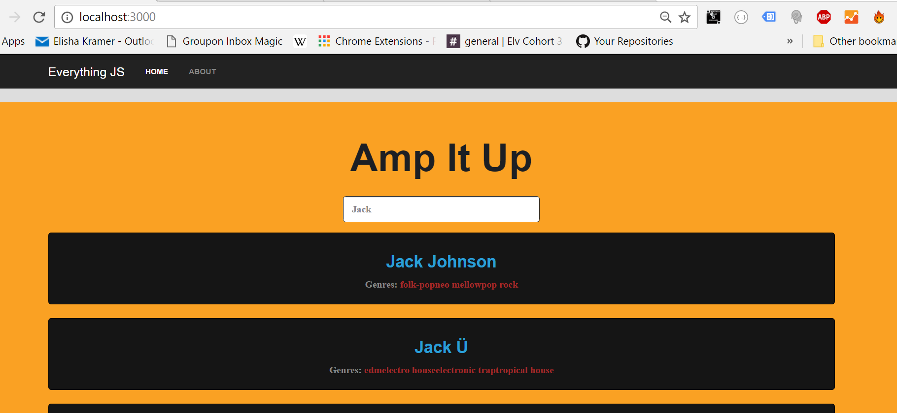

Screenshots:




- [Features](#features)
- [Prerequisites](#prerequisites)
- [Getting Started](#getting-started)
- [Create a new git repo](#create-a-new-git-repo)


Features
--------

- Angular 2
- Spotify API
- Search
- Auto-Suggest (Mid-Typing)


Prerequisites
--------

Node.js and npm are essential to Angular development. 
    
<a href="https://docs.npmjs.com/getting-started/installing-node" target="_blank" title="Installing Node.js and updating npm">
Get it now</a> if it's not already installed on your machine.
 
**Verify that you are running at least node `v4.x.x` and npm `3.x.x`**
by running `node -v` and `npm -v` in a terminal/console window.
Older versions produce errors.


Getting Started
---------------

The easiest way to get started is to clone the repository:

```bash
# Get the latest snapshot
git clone https://github.com/ElishaKay/Angular-2-Spotify-App.git

# Change directory
cd into the project

# Install NPM dependencies
npm install

# Then simply start your app
npm start
